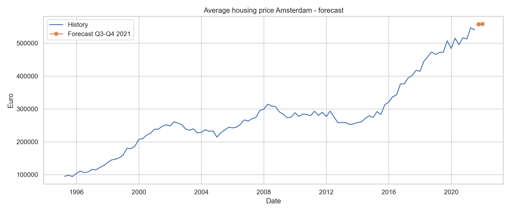

# Amsterdam Housing Price Analysis

Predicting apartment prices in Amsterdam and forecasting the city-wide average
selling price, following the CRISP-DM cycle.

## Problem

The Amsterdam housing market is heterogeneous: a single city-wide model mixes
different price mechanisms across districts and property types. The analysis
therefore picks one homogeneous segment — **West, appartementen** (475 listings,
high record count and strong price correlations) — and answers three questions on it:

1. **Regression** — what is a listing's price, given its physical attributes?
2. **Classification** — which price quartile (low / mid-low / mid-high / high) does it fall into?
3. **Time series** — what will the Amsterdam average selling price be in 2021 Q3 and Q4?

## Data

| File | Rows | Description |
|---|---|---|
| `amsterdam.csv` | 2,692 | Listing-level data: postcode, street, lat/lng, price, area (m²), volume (m³), floors, year built, garden flag, property type, photo count, rooms |
| `timeline_housing_price_amsterdam.csv` | 106 quarters | CBS quarterly series, 1995 Q1 – 2021 Q2: price index, homes sold, average selling price (Netherlands and Amsterdam) |

Postcodes are mapped to *stadsdelen* (districts) from the 4-digit prefix using the
Dutch postcode ranges (1011–1019 Centrum, 1050–1059 West, and so on).

## Approach

**Preparation.** Numeric coercion, median imputation for missing numeric fields,
rule-based removal of impossible values, IQR outlier trimming on `price`, `area`,
`volume`, `rooms`. 475 rows → 472 after rules → 431 used for modelling.
Predictors selected by Pearson correlation with price: `area` (r = 0.887),
`volume` (0.866), `rooms` (0.580), `photos` (0.444); `year_build` dropped (r = 0.052).

**Regression.** Linear Regression, Random Forest, Gradient Boosting, compared by
5-fold cross-validated RMSE (euros) and R².

**Classification.** Price quartiles as labels. Logistic Regression, Random Forest,
KNN and SVM-RBF compared by stratified 5-fold F1-macro and accuracy, plus two
decision trees (`min_samples_leaf` = 2 and 15) for interpretability and a
confusion-matrix accuracy cross-check.

**Time series.** Quarterly Amsterdam average selling price. Moving Average,
Simple Exponential Smoothing, Holt and ARIMA (grid-tuned), trained through 2020
and scored on a 2021 holdout by RMSE and MAPE.

## Results

| Task | Model | Metric | Score |
|---|---|---|---|
| Regression | **GradientBoostingRegressor** | RMSE (5-fold CV) | **€50,898** (R² 0.801) |
| Regression | RandomForestRegressor | RMSE (5-fold CV) | €51,379 (R² 0.798) |
| Regression | LinearRegression | RMSE (5-fold CV) | €53,278 (R² 0.785) |
| Classification | **RandomForestClassifier** | F1-macro (5-fold CV) | **0.641** (acc. 0.643) |
| Classification | SVM-RBF | F1-macro (5-fold CV) | 0.625 (acc. 0.624) |
| Classification | LogisticRegression | F1-macro (5-fold CV) | 0.625 (acc. 0.629) |
| Classification | KNN | F1-macro (5-fold CV) | 0.622 (acc. 0.631) |
| Time series | **ARIMA(1,2,2)** | RMSE / MAPE (holdout) | **€11,138 / 1.89%** |
| Time series | Holt (α=0.4, β=0.1) | RMSE / MAPE (holdout) | €12,724 / 2.40% |
| Time series | Moving Average (w=2) | RMSE / MAPE (holdout) | €23,037 / 3.58% |
| Time series | Exp. Smoothing (α=0.8) | RMSE / MAPE (holdout) | €23,778 / 3.09% |

Linear baseline, for interpretability:

```
price = 19,456.54 + 3,709.64·area + 334.99·volume − 8,887.67·rooms + 1,092.88·photos
```

Tree feature importances agree with the regression: `area` 0.648, `volume` 0.176,
`photos` 0.147, `rooms` 0.029. Size drives price; the negative `rooms` coefficient
reflects that, holding area and volume fixed, more rooms means smaller rooms.

**Forecast** — ARIMA(1,2,2): 2021 Q3 **€558,024**, 2021 Q4 **€558,896**. Prices stay
high and edge upward, i.e. continued pressure rather than a correction over this horizon.



## Running it

```bash
pip install numpy pandas matplotlib seaborn scikit-learn statsmodels
jupyter notebook amsterdam_housing_analysis.ipynb
```

Both CSVs are read from the repository root; run the notebook top to bottom.

## References

- [Amsterdam woningwaarde map](https://maps.amsterdam.nl/woningwaarde/)
- [Dutch postcode list 1000–1999](https://nl.wikipedia.org/wiki/Lijst_van_postcodes_1000-1999_in_Nederland)
- [Waarderingskamer](https://www.waarderingskamer.nl/)
